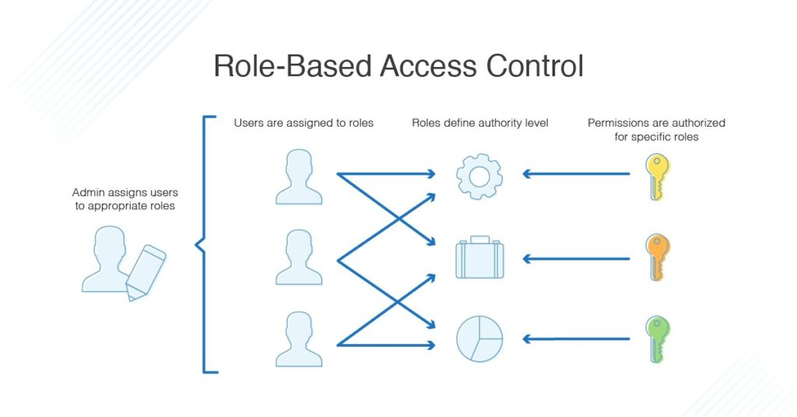
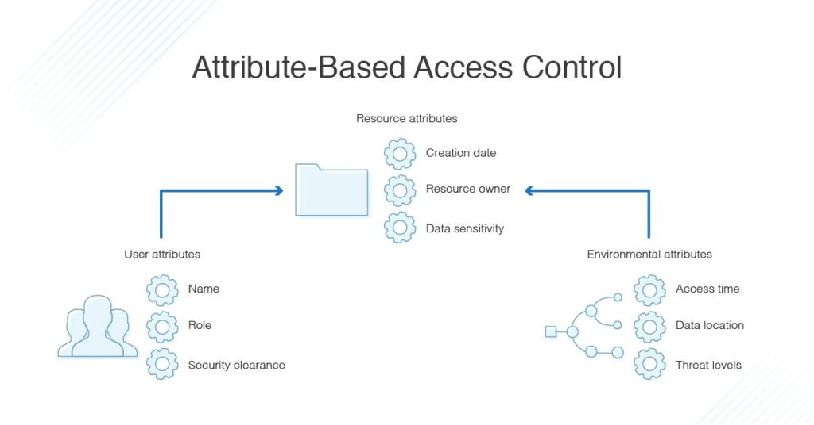

## RBAC vs ABAC

Network users must be both authenticated and authorized  before they can access parts of the system capable of leading to security breaches The process of gaining authorization is called access control.

Two main methods for managing access control for your systems—**role-based access control (RBAC)** and **attribute-based access control (ABAC)**.

RBAC provides access to resources or information based on user roles.

ABAC provides access rights based on user, environment, or resource attributes.
