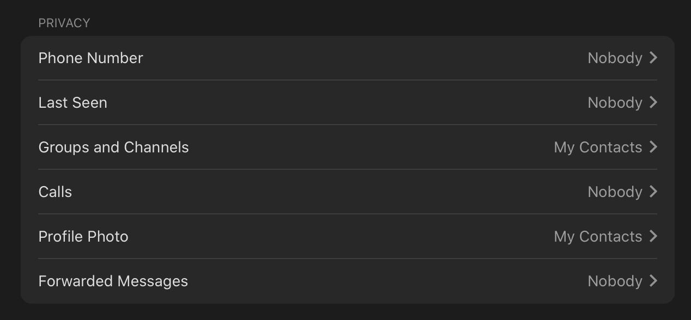
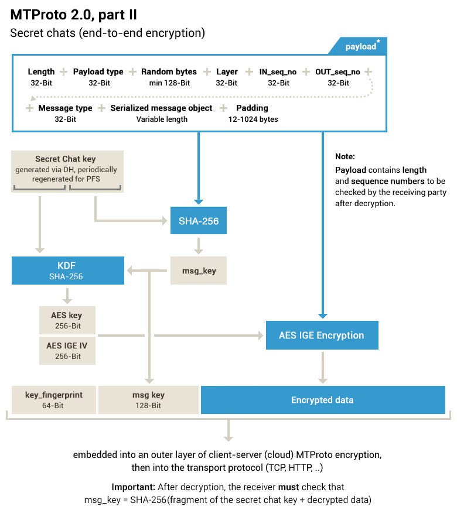

# Account protection

1. Enable 2FA (Settings > Privacy and Security > 2-Step Verification).
2. No recovery email.
3. Turn on Passcode.
4. Check leaked info: https://t.me/infoleakbot
5. Hide phone number and other settings (Settings > Privacy and Security)

   

6. Disable Sync Contacts.
7. Disable showing avatar.
8. Disable showing profile.
9. Change first and last name, change username.
10. Enable Anonymous Group Admins.

### Info

You can use [**@GDPRbot**](https://t.me/gdprbot) to:
- Request a copy of all your data that Telegram stores.
- Contact us about Data Privacy.

---

Telegram’s special [secret chats](https://telegram.org/faq#secret-chats) use end-to-end encryption, leave no trace on our servers, support  self-destructing messages and don’t allow forwarding. On top of this,  secret chats are not part of the Telegram cloud and can only be accessed on their devices of origin.

---

[Server-client encryption](https://core.telegram.org/mtproto) is used in Cloud Chats (private and group chats), Secret Chats use an additional layer of [client-client encryption](https://core.telegram.org/api/end-to-end). 

Our encryption is based on 256-bit symmetric AES encryption, 2048-bit RSA encryption, and Diffie–Hellman secure key exchange. 

---

Telegram supports [verifiable builds](https://telegram.org/blog/verifiable-apps-and-more), which allow experts to independently verify that our code published on GitHub is the **exact same code** that is used to build the apps you download from App Store or Google Play.

---

You can order your messages, photos, videos and files to [self-destruct](https://telegram.org/faq#q-how-do-self-destructing-messages-work) in a set amount of time after they have been read or opened by the  recipient. The message will then disappear from both your and your  friend's devices.

---

We can't help you unless you have access either to the phone number or to Telegram itself on any of your devices.

---

https://core.telegram.org/techfaq

---

Server-client encryption

---

End-to-end encryption

